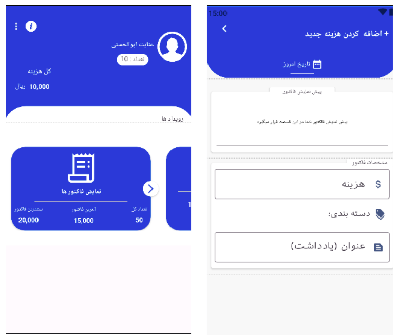

# CashMate | خرج‌یار

A simple and intuitive personal expense management application.  
CashMate helps users easily record, manage, and analyze their daily expenses and gain better control over their financial habits.

> ⚠️ This app is currently under active development. New features will be added gradually.

---

## ✨ Features (Current & Upcoming)

- Easily record daily expenses
- Display total spending
- Smooth and user-friendly UI
- Local data storage 
- Expense categories (in progress)
- Charts and analytics (coming soon)

---

## 🛠️ Tech Stack

- Java
- Android Studio
- Material Design
- (Soon) MVVM Architecture + Room Database

---

## 🚧 Roadmap

- Add categories and filtering options
- Add visual reports (daily / weekly / monthly)
- Export reports (PDF / CSV)
- Light/Dark theme support
- Backup & Restore functionality

---

## 📌 Project Status

The project is at an early stage of development. Any ideas, contributions, and feedback are welcome!

---

## 📸 Screenshots

### Home Screen

### Add Expense

---

## 📜 License

This project is open-source. You are free to use and improve it — just remember to credit the original repository.

---

⭐ If you like this project, please give it a star on GitHub!

---

---

# خرج‌یار | CashMate

اپلیکیشن مدیریت هزینه‌های شخصی با رابط کاربری ساده و جذاب  
هدف خرج‌یار این است که کاربران بتوانند به راحتی هزینه‌های روزانه خود را ثبت، مدیریت و تحلیل کنند و کنترل بهتری روی وضعیت مالی داشته باشند.

> ⚠️ اپلیکیشن در حال توسعه است و امکانات جدید به مرور اضافه می‌شوند.

---

## ✨ امکانات (فعلی و در دست انجام)

- ثبت هزینه‌های روزانه به ساده‌ترین شکل
- نمایش مجموع هزینه‌ها
- رابط‌کاربری کاربرپسند و روان
- ذخیره‌سازی محلی داده‌ها 
- دسته‌بندی هزینه‌ها (در دست توسعه)
- نمایش نمودارهای مالی و گزارش‌ها (در آینده)

---

## 🛠️ تکنولوژی‌ها

- Java
- Android Studio
- Material Design
- (به‌زودی) معماری MVVM + Room Database

---

## 🚧 نقشه راه

- افزودن بخش دسته‌بندی و فیلتر
- گزارش‌های نموداری (روزانه / هفتگی / ماهانه)
- خروجی گرفتن PDF / CSV
- پشتیبانی از حالت شب
- قابلیت پشتیبان‌گیری و بازیابی اطلاعات

---

## 📌 وضعیت پروژه

پروژه در مراحل ابتدایی توسعه قرار دارد و هرگونه پیشنهاد یا مشارکت با آغوش باز پذیرفته می‌شود.

---

## 📸 تصاویر

### صفحه اصلی

### افزودن هزینه

---

## 📜 مجوز

این پروژه متن‌باز است — آزاد هستید از آن استفاده کنید و توسعه‌اش دهید، فقط نام منبع فراموش نشود.

---

⭐ اگر از پروژه خوشتان آمد، لطفاً یک ستاره در گیت‌هاب بزنید!
